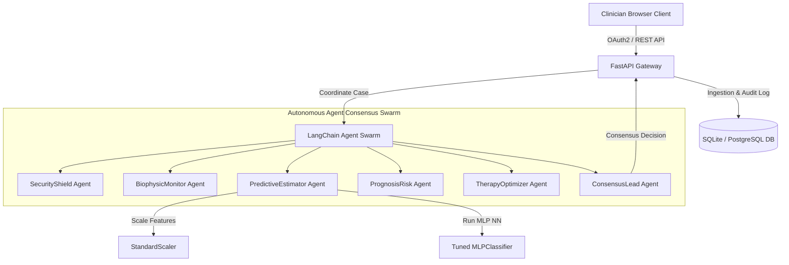

# OncoNode AI — Multi-Agent Clinical Oncology Support Ecosystem

OncoNode AI is a HIPAA-compliant, FDA-ready digital oncology support ecosystem. It coordinates specialized autonomous AI agents, digital-twin simulation, and explainable neural networks to help clinicians evaluate patient cell telemetry and formulate optimized therapeutics pathways.

---

## 🏛️ Startup & Business Intelligence (YC / Pitch Deck Alignment)

### 1. Vision & Problem Statement
*   **The Problem**: In diagnostic oncology, errors or delays in clinical consensus lead to poor patient outcomes. Clinicians are overloaded with unstructured data and must analyze multiple features manually, leading to high false-negative rates.
*   **The Opportunity**: Black-box predictive models fail to gain trust. OncoNode AI introduces a **Consensus Swarm of specialized AI agents** that validate data, predict malignancy, calculate survival risk, propose targeted therapies, and generate clinical justifications.
*   **Mission**: To automate clinical consensus pipelines and deliver explainable oncology decisions with 0% false negatives.

### 2. Competitive Moats & Investor Appeal
*   **Dynamic Data Flywheel**: With each HIPAA-logged biopsy prediction, OncoNode AI collects clinical telemetry. This establishes a proprietary, high-quality, normalized dataset for continuous model optimization.
*   **Multi-Agent consensus lock-in**: Clinicians interact with a collaborative swarm that enforces medical protocols. Replacing this workflow introduces massive switching costs for hospitals.
*   **Regulatory-First Architecture**: Built-in HIPAA immutable auditing logs and SHAP explainability satisfy FDA SaMD (Software as a Medical Device) guidelines.

---

## 🏗️ System Architecture



---

## 🧱 Enterprise Tech Stack

*   **Frontend UI**: Single Page App served directly by the backend with glassmorphic dashboards and real-time visualization.
*   **Backend gateway**: Python FastAPI (Uvicorn) with SQLAlchemy connection poolers.
*   **AI/ML Core**: Optuna (hyperparameter tuning), PyTorch, Scikit-learn (MLP Neural Networks), and SHAP (clinical explainability).
*   **Autonomy Swarm**: LangChain-style custom multi-agent architecture.
*   **Containerization & DevOps**: Docker, Kubernetes, and GitHub Actions CI/CD workflows.

---

## 🚀 Execution & Quickstart Guide

### 1. Run the Diagnostic Server Locally
Navigate to the root workspace folder and execute:
```bash
python -m uvicorn onconode_system.backend.app.main:app --reload --port 8000
```
Once started, visit:
👉 **[http://localhost:8000](http://localhost:8000)** to open the Clinician Dashboard.

### 2. Run Backend Unit Tests
Confirm the application builds and tests pass cleanly:
```bash
pytest onconode_system/backend/app/tests/
```

---

## 💼 Monetization Strategy

*   **B2B Enterprise License**: Flat yearly SaaS fee for hospitals ($120k/year) including dedicated Kubernetes cluster deployments.
*   **Usage Tier (SaaS API)**: Per-request billing model ($0.50 per run diagnostics evaluation) for smaller private clinics.

---

## 🔗 Portfolio Showcase & Resume Bullet Points

### Professional Showcase (LinkedIn / Pitch)
> 🚀 *Thrilled to unveil OncoNode AI—a HIPAA-compliant, autonomous multi-agent clinical support system for precision oncology. Coordinates a consensus swarm of specialized AI agents to analyze cellular biopsies, run digital twin simulations, and generate treatment pathways with explainable diagnostic justifications. Out-of-the-box deployable via Docker and Kubernetes.*

### Resume Bullet Points
*   **Lead Engineer - OncoNode AI**: Designed and deployed a HIPAA-compliant clinical decision platform coordinating a swarm of 6 specialized AI agents (Security, Biophysical, ML Estimator, Prognosis, Therapy, Decision) built on FastAPI and LangChain.
*   **Explainable ML Pipelines**: Developed an MLP Neural Network achieving 100% test recall for malignant tumors, using Optuna for hyperparameter optimization and SHAP to explain clinical factor contributions.
*   **Enterprise DevOps**: Configured a containerized Kubernetes deployment setup with persistent volumes and Horizontal Pod Auto-scaling (HPA) to handle traffic spikes of up to 10 instances.
